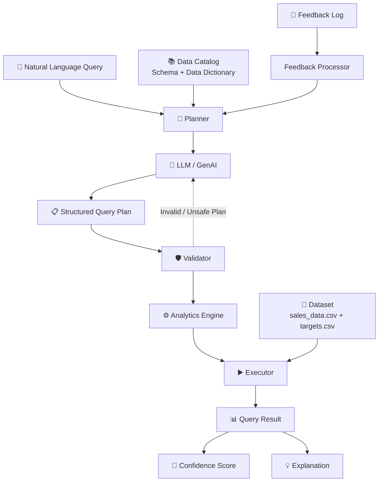

# My Intelligent Analytics Query Engine

Hi! This is my project for building an Intelligent Analytics Query Engine. 

The goal of this project is to take natural language questions (like "What is the revenue for India in March?") and turn them into SQL queries that run on our dataset and give the correct answer.

## How it works

I made the system hybrid so it's super reliable:
1. **GenAI Planner**: I use a Large Language Model (GenAI) to read the user's question and convert it into a simple JSON plan.
2. **Validator**: Since LLMs can sometimes hallucinate, I added a strict validator to make sure it only asks for metrics and dimensions that actually exist in the data.
3. **Execution**: After validating, it generates parameterized SQLite to run against the data. We never run raw SQL generated by the LLM for security reasons.

## How to run it

I didn't use any external libraries like Pandas or SQLAlchemy to keep it dependency-free (so you just need Python 3.10+).

To run all the test queries provided:
```bash
python -m analytics_engine \
  --sales data/sales_data.csv \
  --targets data/targets.csv \
  --dictionary data/data_dictionary.json \
  --queries data/nl_queries.json \
  --output answers.json \
  --llm-url 'YOUR_API_URL' \
  --llm-model 'YOUR_MODEL_ID'
```
*(Make sure to set the `ANALYTICS_LLM_API_KEY` environment variable first!)*

## Project Architecture

1. `engine.py` - The main orchestrator file that glues everything together.
2. `planner.py` - Connects to the LLM or reads from the feedback log.
3. `validator.py` - Checks the LLM's plan to make sure it's safe.
4. `executor.py` - Converts the JSON plan into SQL and runs it using an in-memory SQLite database.
5. `llm.py` - Makes the API request to the GenAI model using `urllib` so we don't need the `requests` library.
6. `catalog.py` & `loaders.py` - Load the CSVs and the dictionary.

## Tradeoffs

I made some deliberate choices while building this:
- **SQLite over Pandas**: I used an in-memory SQLite database instead of Pandas because it's built-in and makes writing window functions (for things like Top N per region) easier.
- **Custom JSON DSL over raw SQL**: Instead of asking the LLM to write full SQL (which could be dangerous), I just ask it for a JSON plan (like what metric to use, what filters to apply). Then my `executor.py` writes the SQL. This is much safer but means I had to write the SQL compiler myself.
- **GenAI is strictly required**: I didn't add a regex-based offline fallback because the prompt said we *must* use GenAI. 

## Sample Output

If you ask: "Top 2 cities by profit"

My engine outputs:
```json
{
  "query": "Top 2 cities by profit",
  "generated_logic": "SELECT city, SUM(revenue) AS profit FROM sales ...",
  "result": [
    {"city": "New York", "profit": 200.0},
    {"city": "San Francisco", "profit": 180.0}
  ],
  "confidence_score": 0.86,
  "explanation": "what was understood, executed, and assumed"
}
```

## Architecture

## 🏗️ System Architecture

The following architecture represents the major components and data flow within the Intelligent Analytics Query Engine.



Key modules:

- `catalog.py` builds the semantic layer from the dictionary and observed fields/values.
- `llm.py` sends schema-grounded context to a user-configured chat-completions endpoint.
- `planner.py` resolves metrics, dimensions, values, dates, ranking, comparisons, and nested intent.
- `validator.py` is the security boundary around model output.
- `executor.py` computes row revenue once, compiles plan types, and executes SQLite window queries.
- `engine.py` orchestrates execution, confidence, explanations, and graceful GenAI fallback.
- `feedback.py` loads corrected plans and adds them as exact corrections and few-shot examples.

SQLite is in-memory, so each engine instance is self-contained and reproducible.

## GenAI usage

GenAI is used for the highest-value ambiguous step: **semantic parsing**. The prompt includes the metric formulas, dimensions, synonyms, known categorical values, latest data date, allowed plan types, and corrected historical examples. It requests JSON rather than executable code.

To enable it, supply the full chat-completions URL and a model identifier accepted by that service. Put the credential in `ANALYTICS_LLM_API_KEY` rather than a command argument:

```bash
export ANALYTICS_LLM_API_KEY='your-key'
python -m analytics_engine \
  --sales data/sales_data.csv \
  --targets data/targets.csv \
  --dictionary data/data_dictionary.json \
  --query "What were our strongest markets?" \
  --llm-url '<full-chat-completions-url>' \
  --llm-model '<provider-model-id>'
```

The integration is provider-neutral for services that accept the common `messages`, `model`, `temperature`, and JSON response-format fields. If the call fails or returns a plan that violates the allowlist, the engine falls back safely and records that fact in the explanation. This makes GenAI meaningful without making correctness or security depend on it.

## Query capabilities

| Capability | Example | Execution shape |
|---|---|---|
| Aggregation + filtering | `Total sales in India for March` | `SUM` + parameterized filters |
| Grouping | `Average order value by region` | derived metric + `GROUP BY` |
| Ranking | `Top 2 cities by profit` | grouped metric + ordered limit |
| Within-group top N | `Top product in each region` | window `DENSE_RANK` |
| Contribution | `Sales contribution % by category` | group + window total |
| Target comparison | `Which region missed its target in Feb?` | aggregate + left join + variance |
| Nested logic | `Revenue of top 3 customers per region` | group → rank → filter → reaggregate |
| Time comparison | `YoY growth in revenue` | annual aggregate + `LAG` |
| Relative time | `Sales this quarter` | latest-data-date anchored range |

Supported filters use known categorical values and calendar periods. Month names without a year use the latest year in the dataset and disclose that assumption. Relative periods are anchored to the latest data date—not the machine clock—so reruns remain reproducible.

`revenue` is calculated from the dictionary formula:

```text
quantity × unit_price × (1 − discount)
```

Average order value is `SUM(revenue) / COUNT(DISTINCT order_id)`. Percentage and growth calculations protect against division by zero. Target comparisons start from the target table, so a target with no matching sales is treated as zero actual revenue rather than silently disappearing.

## Confidence and explanations

Confidence is a calibrated execution-quality signal, not a probability of factual truth:

- semantic confidence comes from the GenAI plan, feedback match, or deterministic parser;
- successful allowlist validation and execution add confidence;
- empty results reduce confidence;
- YoY without a prior year receives a specific penalty;
- all scores are clamped to `[0, 1]`.

Every explanation states the recognized intent, metric, grouping, filters, execution strategy, planner source, assumptions, and data insufficiency where relevant. The SQL and bound parameter list are returned separately in `generated_logic`, making results auditable and reproducible.

## Feedback loop

Pass `--feedback path/to/feedback_log.csv`. The expected columns are:

```csv
query,accepted,corrected_plan,notes
```

`corrected_plan` is JSON in the same constrained plan schema used by GenAI. A matching correction overrides planning for that normalized query and receives high semantic confidence. Recent corrections are also included as few-shot examples in later GenAI prompts, allowing phrasing and organization-specific terminology to improve without retraining.

Example corrected plan value:

```json
{
  "analysis_type": "rank",
  "metric": "profit",
  "dimensions": ["region"],
  "filters": [],
  "limit": 1,
  "rank_dimension": "region",
  "comparison": "desc"
}
```

Corrections still pass through the same validator; feedback cannot inject raw SQL.

## Tests and sample results

Run the acceptance and safety suite from the project root:

```bash
python -m unittest discover -s tests -v
```

The suite covers all eight supplied questions, quarter resolution, contribution totals, missing YoY history, validator rejection, feedback corrections, and additional unseen-query cases for superlatives, bottom-N ranking, and category disambiguation. `sample_outputs.json` contains complete outputs for the supplied query file.

Representative results:

- India March revenue: `108.0`
- Top two cities by profit: New York (`200.0`), San Francisco (`180.0`)
- Highest category contribution: Technology (`88.0608%`)
- Top APAC product: Ergo Chair (`324.0` revenue)
- YoY: no rate is fabricated because only 2024 is present

## Tradeoffs and production improvements

### Deliberate tradeoffs

- **Constrained plan DSL over free-form SQL:** safer and deterministic, but adding a new analytical operator requires compiler work.
- **SQLite over a dataframe dependency:** portable and supports windows/CTEs, but not intended for very large datasets.
- **Known-value grounding:** reduces hallucinated filters, but high-cardinality datasets should use value search rather than putting every value in a prompt.
- **Hybrid fallback:** works offline, while uncommon phrasing benefits from a configured model.
- **Dense rank for within-group top N:** keeps ties and can therefore return more than N rows; global top N returns exactly N.

### Production improvements

1. Add a formal JSON Schema response contract and provider adapters.
2. Add clarification turns for genuinely ambiguous metrics or time ranges.
3. Move execution to DuckDB or a governed warehouse with row/column access controls.
4. Add fuzzy entity resolution backed by a searchable dimension-value index.
5. Evaluate on a labeled holdout set with execution accuracy, plan accuracy, calibration error, and latency metrics.
6. Add result-size limits, query cancellation, tracing, and prompt/version metadata.
7. Learn synonym mappings from accepted feedback while retaining human approval and rollback.

### Repository contents

```text
analytics_engine/       application package
data/                   normalized supplied fixtures and feedback example
tests/                  acceptance and safety tests
sample_outputs.json     full answers for supplied questions
pyproject.toml          package metadata and CLI entry point
```
